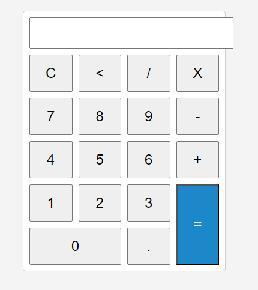

# Simple Calculator

## About the Project
This project is a simple calculator web application built using HTML, CSS, and JavaScript. It features a clean and intuitive user interface that allows users to perform basic arithmetic operations such as addition, subtraction, multiplication, and division.

## Features
- Basic arithmetic operations
- Clear and backspace functionality
- Responsive design for various screen sizes

## Getting Started
To get a local copy up and running, simply clone the repository and open the `index.html` file in your browser.

## Usage
Enter the numbers and operations on the calculator's interface and click '=' to see the result displayed.

## Contributing
Contributions are what make the open-source community such an amazing place to learn, inspire, and create. Any contributions you make are **greatly appreciated**.

## License
Distributed under the MIT License. See `LICENSE` for more information.

## Contact
Túlio Benedito Nhantumbo - beneditotulio28@gmail.com

## Acknowledgements
- Font Awesome
- Normalize.css

